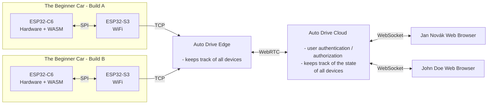

```mermaid
flowchart LR
    subgraph DEVICE1["The Beginner Car - Build A"]
        C61["ESP32-C6<br/>Hardware + WASM"]
        S31["ESP32-S3<br/>WiFi"]
        C61 <-->|SPI| S31
    end

    subgraph DEVICE2["The Beginner Car - Build B"]
        C62["ESP32-C6<br/>Hardware + WASM"]
        S32["ESP32-S3<br/>WiFi"]
        C62 <-->|SPI| S32
    end

    E["Auto Drive Edge <br/> <br/> - keeps track of all devices"]
    C["Auto Drive Cloud <br/> <br/> - user authentication / authorization <br/> - keeps track of the state of all devices "]
    W2["John Doe Web Browser"]
    W1["Jan Novák Web Browser"]

    S31 -->|TCP| E
    S32 -->|TCP| E

    E <-->|WebRTC| C
    C <-->|WebSocket| W1
    C <-->|WebSocket| W2
```
